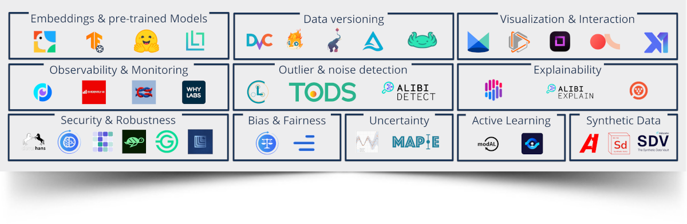

<h1 align="center">Awesome open data-centric AI</h1>

Open source tooling for data-centric AI on unstructured data

		     

**Data-centric AI (DCAI)** is a development paradigm for ML-based solutions. The term was coined by Andrew Ng who gave the following definition:

> Data-centric AI is the practice of systematically engineering the data used to build AI systems. 

At [Renumics](https://renumics.com), we believe DCAI is an important puzzle piece for building real-world AI systems that generate value. We like the following definition:
> Data-centric AI means to improve training datasets systematically and iteratively by leveraging information from trained ML models.

**Tools that can be efficiently used in day-to-day applications** are the most important ingredient for the DCAI paradigm. This curated link collection is intended to help you discover useful open source tools for your data-centric AI workflows.

## 🔎 Scope

We include useful tools that have an **open-source license** and are **actively maintained** in this collection. All tools mentioned are useful for building DCAI workflows on **unstructured data** (e.g. images, audio, video, time-series, text). 

In order to keep a useful focus and to prevent duplicate work, we exclude the following topics:
1. DCAI tools for tabular data. There is an [awesome list](https://github.com/Data-Centric-AI-Community/awesome-data-centric-ai) for that maintained by the [Ydata team](https://github.com/Data-Centric-AI-Community).
2. Labeling tools. Although labeling is part of the DCAI workflow, we refer to the [awesome list](https://github.com/zenml-io/awesome-open-data-annotation) of the [ZenML team](https://github.com/zenml-io) on that topic. 
3. MLOps tooling. There are many gray areas between MLOps and DCAI and some distinctions have yet to be made. We exclude all topics that are clearly out of the DCAI scope (e.g. AutoML, serving, orchestration etc.).

## 📒 Contents

- [Data versioning](#data-versioning)
- [Embeddings and pre-trained models](#embeddings-and-pre-trained-models)
- [Visualization and interaction](#visualization-and-interaction)
- [Outlier and noise detection](#outlier-and-noise-detection)
- [Explainability](#explainability)
- [Active learning](#active-learning)
- [Uncertainty quantification](#uncertainty-quantification)
- [Bias and fairness](#bias-and-fairness)
- [Drift detection and monitoring](#drift-detection-and-monitoring)
- [Augmentation and synthetic data](#augmentation-and-synthetic-data)
- [Adversarial robustness](#adversarial-robustness)

## :open_hands: Contributing
Do you think something is missing? Please help contribute to this list by contacting us or adding a pull request.

# Data versioning

| Logo | Name | Description | Popularity | License |
| ------- | ---- | ----------- | ---------- | -------- |
|  | [Data version control (DVC)](https://github.com/iterative/dvc) | Data Version Control or DVC is a command line tool and VS Code Extension to help you develop reproducible machine learning projects. |  |  |
|  | [deeplake](https://github.com/activeloopai/deeplake) | Data Lake for Deep Learning. Build, manage, query, version, & visualize datasets.  |  |  |
|  | [Pachyderm](https://github.com/pachyderm/pachyderm) | Pachyderm – Automate data transformations with data versioning and lineage. |  |  |
|  | [Git Large File Storage](https://github.com/git-lfs/git-lfs) | Git LFS is a command line extension and specification for managing large files with Git.  |  |  |
|  | [lakeFS](https://github.com/treeverse/lakeFS) | lakeFS is an open-source tool that transforms your object storage into a Git-like repository. |  |  |

# Embeddings and pre-trained models

| Logo | Name | Description | Popularity | License |
| ------- | ---- | ----------- | ---------- | -------- |
|  | [towhee](https://github.com/towhee-io/towhee) | Towhee is a framework that is dedicated to making neural data processing pipelines simple and fast.   |  |  |
|  | [Tensorflow Hub](https://github.com/tensorflow/hub) | TensorFlow Hub is a repository of reusable assets for machine learning with TensorFlow.   |  |  |
|  | [Huggingface transformers](https://github.com/huggingface/transformers) | State-of-the-art Machine Learning for Pytorch, TensorFlow, and JAX.   |  |  |
|  | [Lightly](https://github.com/lightly-ai/lightly) | Lightly is a computer vision framework for self-supervised learning.    |  |  |

# Visualization and Interaction

| Logo | Name | Description | Popularity | License |
| ------- | ---- | ----------- | ---------- | -------- |
|  | [Renumics Spotlight](https://github.com/renumics/spotlight) | Curation tool for unstructured data that connects your stack to the data-centric AI ecosystem.    |  |  |
|  | [FiftyOne ](https://github.com/voxel51/fiftyone) | The open-source tool for building high-quality datasets and computer vision models.   |  |  |
|  | [refinery](https://github.com/code-kern-ai/refinery) | The data scientist's open-source choice to scale, assess and maintain natural language data.   |  |  |
|  | [Argilla](https://github.com/argilla-io/argilla) | Argilla helps domain experts and data teams to build better NLP datasets in less time.    |  |  |
|  | [Xtreme1](https://github.com/xtreme1-io/xtreme1) | Xtreme1 is the world's first open-source platform for multisensory training data.     |  |  |
|  | [Holmes Extractor](https://github.com/richardpaulhudson/holmes-extractor) | Holmes supports a number of use cases involving information extraction from English and German texts. In all use cases (chatbot, structural extraction, topic matching, and supervised classification), the information extraction is based on analysing the semantic relationships expressed by the component parts of each sentence. |  |  |

# Outlier and noise detection

| Logo | Name | Description | Popularity | License |
| ------- | ---- | ----------- | ---------- | -------- |
|  | [Cleanlab](https://github.com/cleanlab/cleanlab) | Cleanlab facilitates machine learning with messy, real-world data by providing clean labels for robust training and flagging errors in your data.  |  |  |
| **PyOD** | [PyOD](https://github.com/yzhao062/pyod) | A Comprehensive and Scalable Python Library for Outlier Detection (Anomaly Detection)     |  |  |
|  | [TODS](https://github.com/datamllab/tods) | An full-stack automated time-series outlier detection system.     |  |  |
|  | [Alibi Detect](https://github.com/SeldonIO/alibi-detect) | Algorithms for outlier, adversarial and drift detection.    |  |  |

# Explainability

| Logo | Name | Description | Popularity | License |
| ------- | ---- | ----------- | ---------- | -------- |
|  | [SHAP](https://github.com/slundberg/shap) | A game theoretic approach to explain the output of any machine learning model.     |  |  |
|  | [Alibi](https://github.com/SeldonIO/alibi) | Alibi is an open source Python library aimed at machine learning model inspection and interpretation.     |  |  |
| **LIME** | [LIME](https://github.com/marcotcr/lime) | Explaining the predictions of any machine learning classifier.     |  |  |
|  | [Captum](https://github.com/pytorch/captum) | Model interpretability and understanding for PyTorch.     |  |  |

# Active learning

| Logo | Name | Description | Popularity | License |
| ------- | ---- | ----------- | ---------- | -------- |
|  | [modAL](https://github.com/modAL-python/modAL) | A modular active learning framework for Python.   |  |  |
|  | [Bayesian Active Learning (Baal)](https://github.com/baal-org/baal) | Library to enable Bayesian active learning in your research or labeling work.     |  |  |

# Uncertainty quantification

| Logo | Name | Description | Popularity | License |
| ------- | ---- | ----------- | ---------- | -------- |
|  | [Uncertainty Toolbox](https://github.com/uncertainty-toolbox/uncertainty-toolbox/) | A Python toolbox for predictive uncertainty quantification, calibration, metrics, and visualization.    |  |  |
|  | [MAPIE](https://github.com/scikit-learn-contrib/MAPIE) | A scikit-learn-compatible module for estimating prediction intervals.     |  |  |

# Bias and fairness

| Logo | Name | Description | Popularity | License |
| ------- | ---- | ----------- | ---------- | -------- |
|  | [AIF360](https://github.com/Trusted-AI/AIF360) | The AI Fairness 360 toolkit helps to detect and mitigate bias in machine learning models throughout the AI application lifecycle.    |  |  |
|  | [Fairlearn](https://github.com/fairlearn/fairlearn) | A Python package to assess and improve fairness of machine learning models.     |  |  |

# Drift detection

| Logo | Name | Description | Popularity | License |
| ------- | ---- | ----------- | ---------- | -------- |
|  | [Deepchecks](https://github.com/deepchecks/deepchecks) | Deepchecks is a Python package for comprehensively validating your machine learning models and data with minimal effort.     |  |  |
|  | [Evidently](https://github.com/evidentlyai/evidently) | An open-source framework to evaluate, test and monitor ML models in production.    |  |  |

# Augmentation and synthetic data

| Logo | Name | Description | Popularity | License |
| ------- | ---- | ----------- | ---------- | -------- |
|  | [Albumentations](https://github.com/albumentations-team/albumentations) | Fast image augmentation library and an easy-to-use wrapper around other libraries.    |  |  |
|  | [Gretel Synthetics](https://github.com/gretelai/gretel-synthetics) | Synthetic data generators for structured and unstructured text, featuring differentially private learning.     |  |  |
|  | [SDV](https://github.com/sdv-dev/SDV) | Synthetic Data Generation for tabular, relational and time series data.     |  |  |

# Adversarial Robustness

| Logo | Name | Description | Popularity | License |
| ------- | ---- | ----------- | ---------- | -------- |
|  | [CleverHans](https://github.com/cleverhans-lab/cleverhans) | An adversarial example library for constructing attacks, building defenses, and benchmarking both.    |  |  |
|  | [Adversarial Robustness Toolbox](https://github.com/Trusted-AI/adversarial-robustness-toolbox) | Python Library for Machine Learning Security - Evasion, Poisoning, Extraction, Inference - Red and Blue Teams.    |  |  |
|  | [Foolbox](https://github.com/bethgelab/foolbox) | Foolbox is a Python library that lets you easily run adversarial attacks against machine learning models like deep neural networks.    |  |  |

